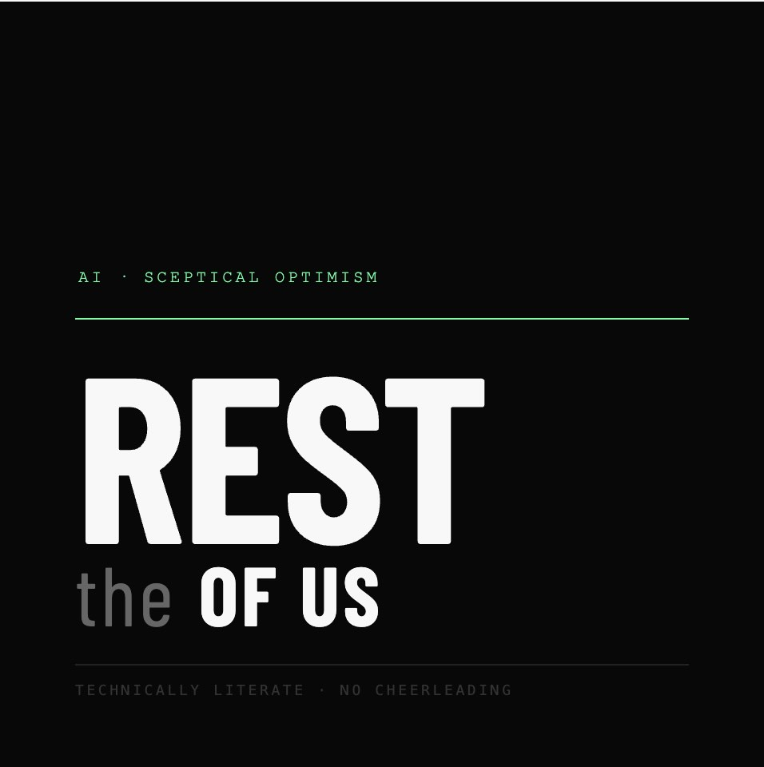

# The Rest of Us



A fully automated daily AI podcast. Aggregates the top AI stories from Hacker News, arXiv, lab blogs, and tech journalism, generates a natural two-host dialogue via Claude, renders audio with Gemini TTS, and publishes to Apple Podcasts via GitHub Releases + Pages.

**No human intervention required.** A launchd job runs the pipeline each morning and the episode is waiting in your podcast app by 7am.

## How it works

```
Sources (HN, arXiv, lab blogs, VentureBeat, Ars Technica)
  --> Collect & rank stories by cross-source signal
    --> Enrich with web search context (Tavily)
      --> 3-pass script generation (Claude)
        --> Beat sheet (conversation blueprint)
        --> Natural dialogue (two distinct hosts)
        --> TTS refinement (prosody optimization)
          --> Audio rendering (Gemini 2.5 Flash TTS, 2-speaker)
            --> Publish (GitHub Release + RSS feed)
```

## The hosts

- **Kit** (The Maker) -- Tech, product, and design background. Asks *"what does this change about how something gets made?"* Measured delivery. Occasionally devastating in a single quiet sentence.

- **Dean** (The Capital Allocator) -- Venture background. Asks *"who wins, who loses, when does the money run out?"* Warm but fast-paced. Thinks in market structure and defensibility.

Their frames diverge structurally -- the best segments are when those questions point in opposite directions.

## Quick start

```bash
# Install
uv sync
brew install ffmpeg

# Run the full pipeline
make run

# Or run individual stages
make collect    # free, no API costs
make script     # generate dialogue (Claude API)
make audio      # render audio (Gemini TTS)
```

Run `make help` for all available targets.

## Configuration

Copy `.env.example` to `.env` and fill in your API keys:

| Variable | Required | Purpose |
|----------|----------|---------|
| `ANTHROPIC_API_KEY` | Yes | Script generation (Claude) |
| `GEMINI_API_KEY` | Yes | Audio rendering (Gemini TTS) |
| `GITHUB_TOKEN` | Yes | Publishing releases and committing feed |
| `GITHUB_REPO` | Yes | `owner/repo` for releases + pages |
| `PODCAST_BASE_URL` | Yes | GitHub Pages URL for RSS feed |
| `TAVILY_API_KEY` | No | Web search enrichment (skipped without it) |

See `.env.example` for the full list including voice selection, TTS backend, and schedule options.

## Daily scheduling

The pipeline can run automatically each morning via macOS launchd:

```bash
make install-schedule    # install the daily 6:35am job
make uninstall-schedule  # remove it
```

The wrapper script (`scripts/run-daily.sh`) retries once on failure and sends macOS notifications.

## Listening

1. Enable GitHub Pages on the repo (Settings > Pages > Deploy from `main`)
2. Run `make run` to generate the first episode
3. In Apple Podcasts: Library > Add a Show by URL > `https://<owner>.github.io/<repo>/feed.xml`

New episodes appear automatically each morning.

## Adding sources

The source architecture is pluggable. To add a new source:

1. Create `src/hn_signal/sources/new_source.py` with a `collect()` function
2. Return stories in the unified format (see existing sources for examples)
3. Add the module to `SOURCES` in `sources/__init__.py`

## Stack

- **Script generation**: Claude Sonnet (3-pass: beat sheet, dialogue, TTS refinement)
- **Summary extraction**: Claude Haiku
- **Audio**: Gemini 2.5 Flash TTS (24kHz, single-pass 2-speaker) with ElevenLabs fallback
- **Sources**: Hacker News API, arXiv RSS, lab blog RSS, VentureBeat, Ars Technica
- **Distribution**: GitHub Pages (MP3 hosting + RSS feed)
- **Runtime**: Python 3.12, uv, ffmpeg

## License

MIT
